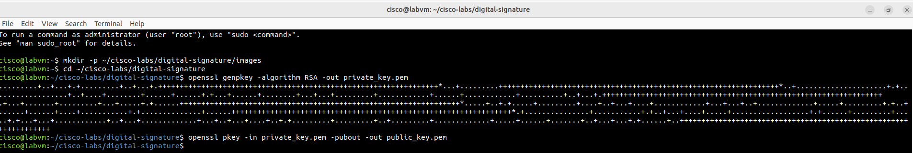
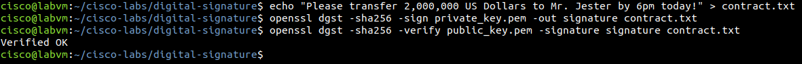
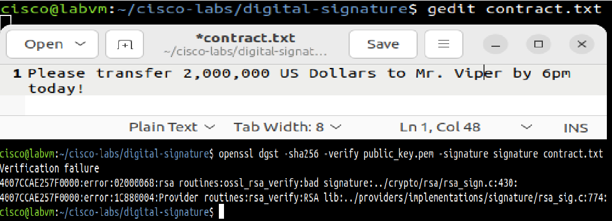

# Laboratorio: Generación y Uso de una Firma Digital con OpenSSL

## 📋 Descripción del Proyecto
Este laboratorio práctico simula la implementación de controles criptográficos orientados a garantizar la **Tríada Criptográfica (Autenticidad, Integridad y No Repudio)** en documentos comerciales críticos. Utilizando herramientas de cifrado modernas en un entorno Linux (`OpenSSL`), se emitió una identidad digital basada en criptografía asimétrica para firmar un contrato financiero y, posteriormente, se simuló un ataque de alteración de datos para comprobar la capacidad de detección de fraude del sistema.

---

## 🎯 Objetivos
* Generar y administrar un par de claves criptográficas asimétricas (**RSA**) mediante OpenSSL.
* Aplicar funciones hash seguras (**SHA-256**) combinadas con claves privadas para firmar digitalmente un documento.
* Validar la autenticidad e integridad de un archivo firmado utilizando la clave pública correspondiente.
* Demostrar la detección de anomalías e invalidación de firmas ante modificaciones no autorizadas en los datos.

---

## 🛠️ Tecnologías y Herramientas Utilizadas
* **Sistema Operativo:** Linux (CSE-LABVM / Entorno Virtualbox).
* **Herramienta Criptográfica:** OpenSSL.
* **Algoritmos:** RSA y SHA-256.
* **Editores y Utilidades:** `echo`, `gedit`.

---

## 🚀 Desarrollo Paso a Paso

### 1. Generación de la Identidad Criptográfica (Par de Claves RSA)

```bash
mkdir -p ~/cisco-labs/digital-signature/images
cd ~/cisco-labs/digital-signature
openssl genpkey -algorithm RSA -out private_key.pem
openssl pkey -in private_key.pem -pubout -out public_key.pem
```

> **Perspectiva de Ciberseguridad (SOC):** La clave privada debe mantenerse estrictamente confidencial bajo control del emisor para garantizar el **No Repudio**.

* **Evidencia - Generación de Claves:**
  

---

### 2. Creación del Contrato Crítico y Firma Digital

```bash
echo "Please transfer 2,000,000 US Dollars to Mr. Jester by 6pm today!" > contract.txt
openssl dgst -sha256 -sign private_key.pem -out signature contract.txt
openssl dgst -sha256 -verify public_key.pem -signature signature contract.txt
```

> **¿Por qué funciona?:** La función hash calcula una huella digital única del archivo de texto y la cifra con la clave privada, vinculándola de forma exclusiva al contenido exacto.

* **Evidencia - Firma y Verificación Exitosa:**
  

---

### 3. Simulación de Incidente: Ataque de Alteración

```bash
gedit contract.txt
openssl dgst -sha256 -verify public_key.pem -signature signature contract.txt
```

> **Perspectiva de Ciberseguridad (Detección de Fraude):** Al cambiar una sola letra en el texto, el hash SHA-256 cambia por completo, provocando que la verificación falle de inmediato.

* **Evidencia - Fallo de Verificación por Manipulación:**
  

---

## 💡 Conceptos Aprendidos
* Criptografía Asimétrica y Funciones Hash.
* Garantía de Autenticidad, Integridad y No Repudio.
* Detección temprana de modificaciones no autorizadas en archivos corporativos críticos.

---
*Documentación estructurada con enfoque profesional para portfolio de Ciberseguridad / SOC.*
